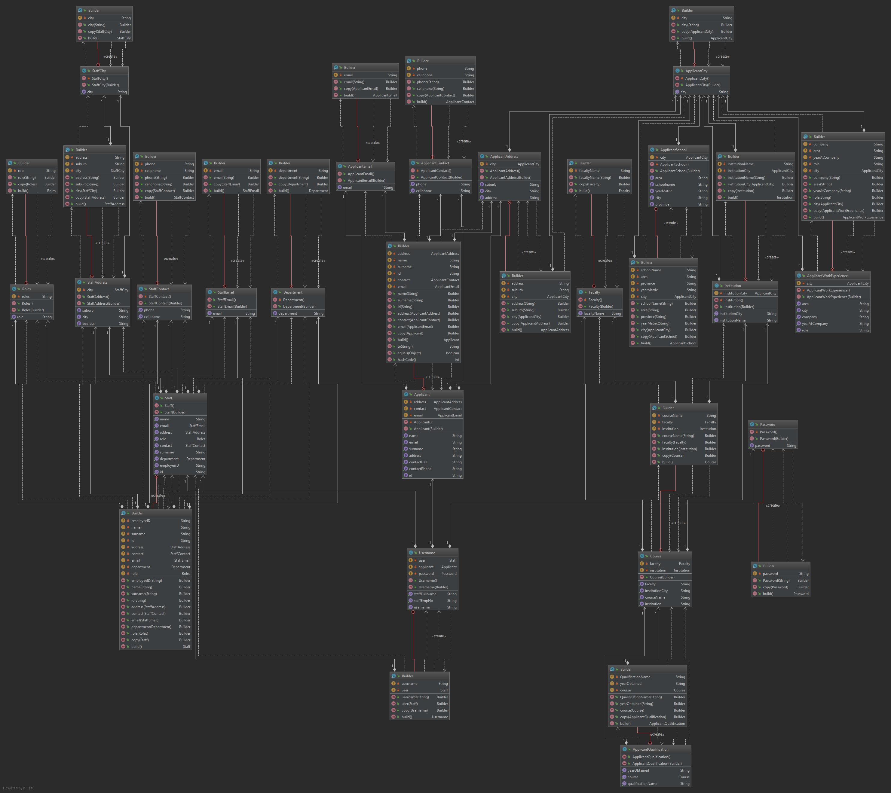

HR recruitment process.
A company accepts applications for a vacancy ads placed. The ad is placed by the HR admin, and approved by the department Manager.
All applications are manually captured and kept on the system until completion of the process, some students are withdrawn for non-compliant, or unsuccessful. Other are processed, using tests or assessments and interviews. After the interview process, references is contacted, after a good reference process, an offer is sent, when the offer is accepted, the application is closed and the applicant is employed.

The problem (Currently)
HR Admin staff accepts paper based forms, tests and interview notes. The process is very manual, and has a lot of paper work.

The Solution
I would like to make this process electronic. I will like to make an online form (Website) that captures this information and stores it in a database. A HR admin desktop program (Java), that can manage the system and data, and reports that can be retrieved showing data relevant to each process.

#### <u>Please see UML Class Diagram below:</u>
